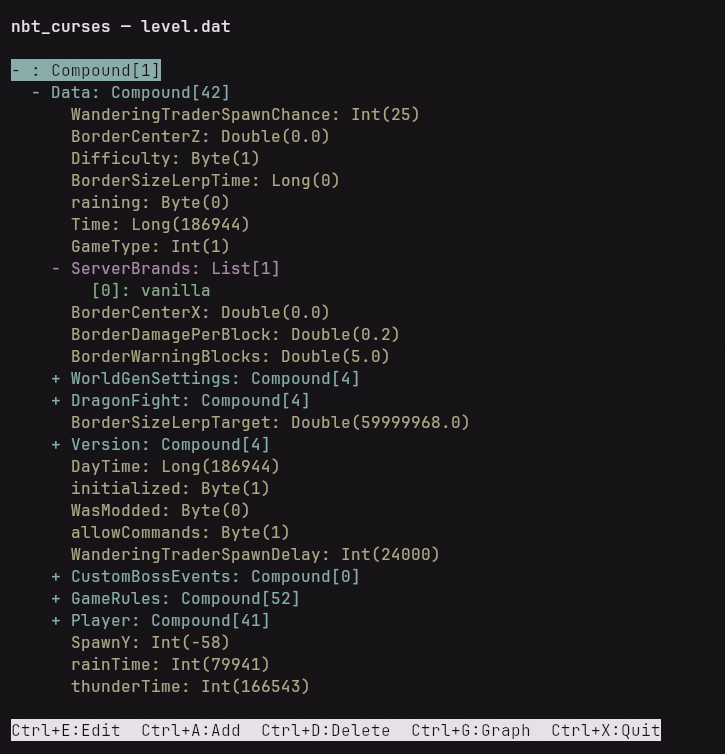

# nbt_curses
Terminal based NBT Explorer/Editor

View and edit minecraft NBT files directly in your terminal



## Features
- Navigate NBT files easily
- Edit/Add/Delete tags
- Color coded display

## Installation
### Requirements
```shell
pip install nbtlib
```
### Option 1: Run directly
```shell
python main.py path/to/nbtfile
```

### Option 2: Build a standalone executable
```shell
pip install pyinstaller
pyinstaller --onefile main.py --name nbt_curses
./dist/nbt_curses path/to/nbtfile
```